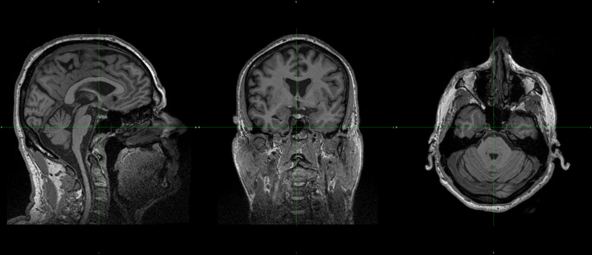
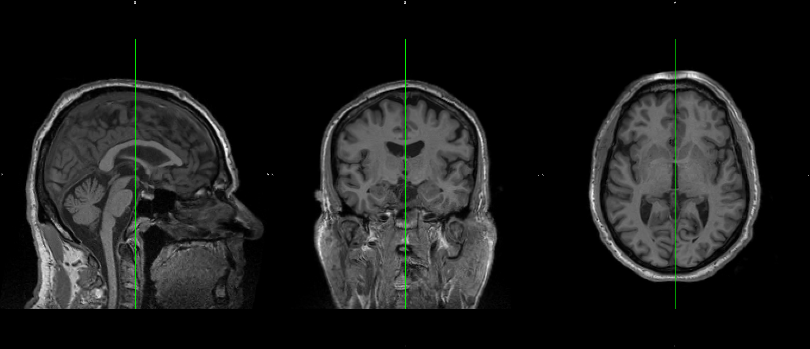

# nifti_align  

*Credit goes to the AFNI team, this is a wrapper to simplify alignment of nifti-images*

Easily align 3d nifti volumes to a template using afni tools with one line. The only benefit to using this script is lazyness, so that you can align one or more files with a single line and not have any extreneous outputs. Works for nifty and mgz image types. Outputs nifti. Default template expects a T1 and uses an ACPC SS'd brain as the target (see below or code for details). You can easily replace it for any other template such as a non-SS'd brain, a "native" space head for longitudinal alignment, PET and T2/FLAIR types too, just use the NMI flag for aligning different modalities. Additional files such as masks can be transformed at the same time using either linear or nearest resampling. At least one image should be selected for reslicing. 

Can be used as a coregistration tool for rigid-body alignments using a non-rigid best fit.

Requires working AFNI tools installation. 

What exactly does it do?
* Reset origin to center of image
* Find a spatial transformation to tlrc space
* Convert that matrix to rigid-only parameters that best fit the warp
* Use the matrix to reslice as many images as you input

   ***********************
   *** Nifty Align Tool **
   ***********************
    
   Align nifti images to a template using rigid transformation
    
   Do not use periods (.) in image names, all text after the first (.) is treated as an extension
    
   Some more comments are available in the script. This isn't well written or anything.
   A better approach would be re-writing @auto_tlrc which is itself a wraper of AFNI tools
   This is better than using 3dwarpdrive or other registration tools I have found because it uses
   Nonlinear warping to find the alignment, then it estimates a rigid-body transformation to fit

## All credit goes to the AFNI team, this is just a dumb script to automate a few things.  

     
      options:
      -h, --help                    Show this menu
      -i, --input       <path>      Input (brainmask / nu / anything)
          --skullstrip              Skull strip flag (optional)
                                      Used to skull strip the input volume for good fit to template. 
                                      Does not save the SS'd volume. 
                                      Use when input dataset includes skull and template does not
                                      Default template is SS'd
                                      Not recommended to use a template with neck and jaw.
                                      Using FS aparc+aseg works okay when template is also aparc+aseg. 
          --template    <path>      Template to align to (optional)
                                      Default template is skullstripped TT_N27_brainmask.nii
                                      Either SS your input or use SS'd vol
                                      SS alignment is much more accurate/reliable.
      -n, --nearest     <path>      Reslice img with NN
      -l, --linear      <path>      Reslice img with trilinear
          --keepmat                 Keep the afni transformation matrix
          --prefix      <str>       Prefix for output (default: 'a_')
          --nmi                     NMI cost funct. Default is lpc, good for T1w
                                      Good for PET alignment
                                    AFNI offers many good cost functions, just edit the
                                      script if you want to use a different one
                                      
## Examples:
### Before:
   
### Code: 
    Use nu.nii for transformation and reslice nu.nii. Skullstrip to fit to template (does not keep SS'd output). 
    $ nifti_align -i nu.nii -l nu.nii --skullstrip
### After:
   

# Example commands
1. > **nifti_align -i nu.nii -l nu.nii -n aparc+aseg.nii --keepmat --skullstrip**

    > '-i nu.nii' Use nu.nii to find the transformation.  
    > '-l nu.nii' reslice nu.nii using linear interp  
    > '-n aparc+aseg.nii' reslice aparc+aseg.nii using linear interp  
    > '--keepmat' keep the transformation matrix  
    > '--skullstrip' Skullstrip nu.nii before warping. Required if using T1 with skull.  
    
    **Output:**  
    1. a_nu.nii
    2. a_aparc+aseg.nii
    3. nu.Xat.rigid.1D - transformation matrix
    
2. > **nifti_align -i brainmask.nii -l nu.nii -l registered_PET.nii -n aparc+aseg.nii -n mask2.nii -n mask3.nii --prefix aligned_**

    > '-i brainmask.nii' Use brainmask.nii to find the transformation.  
    > '-l nu.nii' reslice nu with linear interp  
    > '-l registered_PET.nii' reslice a PET image that has already been registered to the T1.  
    > '-n aparc+aseg.nii' reslice aparc+aseg.nii mask using linear interp  
    > '--prefix aligned_' Rather than the default "a_" prefix, use "aligned_"  
    
    **Output:**
    1. aligned_nu.nii
    2. aligned_registered_PET.nii
    3. aligned_aparc+aseg.nii
    4. aligned_mask2.nii
    5. aligned_mask3.nii
